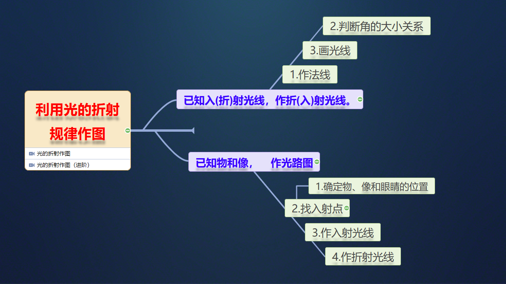

# 3.4 探究光的折射规律

<table>
  <tr>
      <td><b>教学课题</b></td>
      <td>3.4 探究光的折射规律</td>
      <td><b>授课科目</b></td>
      <td>物理</td>
  </tr>
  <tr>
      <td><b>对应教材</b></td>
      <td>《物理》61页-64页</td>
      <td><b>授课老师</b></td>
      <td>WEIAI</td>
  </tr>
  <tr>
      <td><b>授课年级</b></td>
      <td>397班、403班</td>
      <td><b>计划课时</b></td>
      <td>2课时</td>
  </tr>
</table>

## 教学目标

> **:star:知识与技能：**
  - 了解光的折射现象。
  - 知道光从空气射入水或其他介质中的偏折规律。
  - 了解光在发生折射时，光路的可逆性。

> **:zap:过程与方法：**
  - 通过实验观察，认识折射现象。
  - 体验由折射引起的错觉。

> **:cloud:情感态度与价值观：**
  - 初步领略折射现象的美妙，获得对自然现象的热爱、亲近感。

## 教学重难点

**教学重点：**

- 光的折射现象。观察、分析实验，归纳出光的折射规律。

**教学难点：**

- 观察、分析实验，归纳出光的折射规律及在折射中光路是可逆的。

## 教具准备

水槽、水、激光发射器、一个可折转的光屏、玻璃砖、多媒体电脑及投影仪等。

## 教学过程

#### 一、创设情景 明确目标：

1. 学生实验：“折射断筷”。学生观察后叙述实验现象。(从生活中发现问题)
2. 小游戏：碗中放入一枚硬币，调整眼睛到刚好看不见硬币的位置，另一同学向碗中缓慢倒入水，当水升到一定高度时， 观察现象? (激发学生兴趣)
3. 提问：上述现象是怎样引起的？能否用以前学的知识解释？(学生思考后，感到知识不足，引起求知欲)

#### 二、自主学习 指向目标：
阅读课本，思考课本<u>“活动1”</u>部分。
- [x] 折射的定义
- [ ] 生活中的折射现象

#### 三、合作探究 达成目标：

> ** :boat:探究点一 光的折射现象**

1. 猜想什么条件下，会发生光的折射?
2. 自选器材分组实验，验证猜想。
3. 交流实验过程及观察到的现象。
4. 学生归纳“什么叫光的折射”。(①学生叙述中若没注意“斜射”条件，可以让其他学生补充，教师不必提示； ②锻炼学生的概括能力。)
   
> **:airplane:探究点二 探究光的折射规律**

**探究 1**：光从空气斜射入水(玻璃)中，折射光线向界面偏折，还是向法线偏折
  *(进一步激发求知欲， 明确探究目的)*
  > 学生猜想，并在黑板上画出自己猜想的折射光线的位置。
  > 讨论猜想的合理性。
  > 小组设计实验方案并交流，确定可行方案。
  > 进行实验收集证据。
  > 交流实验结果

- 每个组各得到什么结论?
- 不同组的结论是否相同?

用语言表达探究的结果。

[教师点拨]
**结论1**：光从空气斜射入水或其他介质时，折射光线向法线偏折(折射角小于入射角).

**探究2**： 多改变几次入射光的方向，你还会发现什么规律？
1. 分组实验，收集证据。(要求仔细观察对比现象，画出观察结果)
2. 组内对观察结果比较分析。
3. 交流，(1)如何定义折射角?(2)折射角随入射角的增大如何变化?(3)当光垂直入射时，光的传播方向如何?

[教师点拨]
**结论2**： 折射角随入射角的增大而增大。
**结论3**： 光垂直入射时光的传播方向不变。

> (设疑)“折射断筷”、“水中硬币升高”都是光的折射现象，能否用刚才得到的结论解释呢？(学生讨论后产生了新的疑问：刚才的结论是光从空气进入水中的折射规律而“折射断筷”、“硬币升高”是光从水射入空气中形成的)

**探究3**：光从水(玻璃)斜射入空气中，折射光线向法线偏折还是界面偏折？

1. 学生猜想并画出图表达自己的想法。
2. 讨论交流：老师投影出学生作图的情况。

实验验证：(1)教师演示光从空气斜射入半圆形玻璃砖；(2)哪位同学能帮助老师逆着折射光射入另一束光，让同学们观察光在空气中的传播途径呢？(3)学生观察到光从玻璃中射入空气中的光与原入射光重合。(4)教师要求学生把观察到的现象画到黑板上。

[教师点拨]
**结论4**：光在折射时，光路是可逆的。
**结论5**：光从水或其他介质斜射入空气中，折射光线远离法线偏折(折射角大于入射角).

> **:fuelpump:探究点三 折射规律的应用**

1. 体验“叉鱼”
制作鱼模型并固定于方型水槽中，用直铁丝作鱼叉，对准看到的鱼叉去，看谁能叉准，并让该同学说出能叉准鱼的“奥妙”是什么?
2. 利用动画讲解“鱼的虚像形成的原因”。
3. 学生讨论“折射断筷”、“硬币升高”的原因。
4. 分组实验：观察玻璃砖后的钢笔“错位”。
5. 折射现象不仅会使眼睛“受骗”，有时还会产生一些很美的奇观。

#### 四、总结梳理 达成目标：
通过本节的学习，我们知道了“什么叫光的折射”，光的折射规律：光从空气中斜射入水或其他介质时，折射光线向法线偏折(折射角小于入射角)。光从水或其他介质斜射入空气时，折射光线远离法线偏折(折射角大于入射角)。折射角随入射角的增大而增大。光垂直入射时光的传播方向不变。光在折射时，光路是可逆的。

#### 五、达标检测 反思目标：
完成学生用书“自我评价与作业”、练习册3.4节练习题

## 板书设计

#### 课程标题《3.4 探究光的折射规律》

1. 知识回顾：

|     相关概念     |           反射定律           |     反射种类     |
| :--------------: | :--------------------------: | :--------------: |
| 一点、两角、三线 | 三线共面、两角相等、光路可逆 | 镜面反射、漫反射 |

2. 日常观察：

- 盛有水的碗中的筷子
- 铅笔插入盛有水的玻璃杯中

3. 光的折射现象：

> *两个活动探究*

- **定义**：光由一种介质射入另一种介质时，传播方向会发生偏折，这种现象叫光的折射
- **三线两角**：入射光线、法线、折射光线、入射角、折射角

4. 光的折射定律：

- 三线共面
- 法线居中
- 两角关系
  - 光从空气斜射入水或者其他介质时，折射角小于入射角
  - 光从水等介质斜射入空气中时，折射角大于入射角
  - 入射角增大时，折射角也会增大
  - 光垂直入射时，传播方向不变
- 在折射现象中，光路是可逆的

5. 光的折射和反射的联系

|          |         反射         |          折射          |
| -------- | :------------------: | :--------------------: |
| 三线关系 |  三线共面、法线居中  |   三线共面、法线居中   |
| 两角关系 |  两角相等、同增同减  |   空气中角大、同增同减 |
| 特殊情况 |   垂直入射原路返回   |    垂直入射方向不变    |

6. 利用光的折射规律作图

